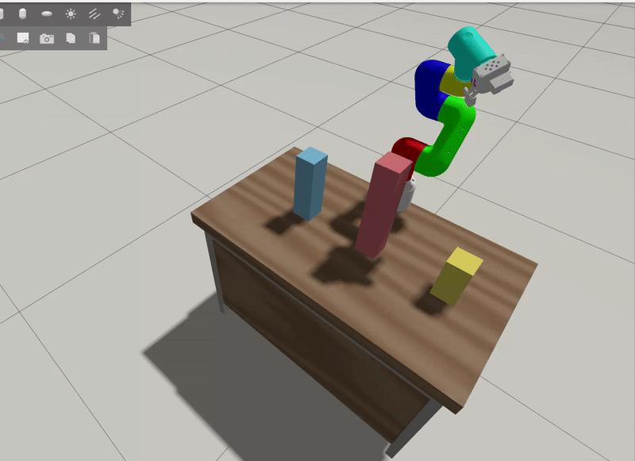

# TP Final — Navegación del myCobot 320 entre torres

## Descripción

El trabajo usa un robot **myCobot 320** de 6 grados de libertad simulado en Gazebo. El mundo se simplificó a un escritorio con **tres torres** de distinta altura apoyadas sobre él:

| Torre | Altura | Posición (y) |
|-------|--------|--------------|
| Alta  | 0.28 m | -0.06 m      |
| Media | 0.20 m |  0.16 m      |
| Baja  | 0.12 m | -0.28 m      |

El robot recorre un trayecto entre las torres sin chocarlas, usando **MoveIt + OMPL** (RRTConnect) para planificación con evasión de colisiones. El recorrido es:

1. Se posiciona sobre el hueco entre la torre alta y la baja.
2. Desciende por el hueco hasta quedar debajo del tope de la torre alta.
3. Sube y cruza por encima de la torre alta.
4. Queda sobre el hueco del otro lado.

Los obstáculos (torres y escritorio) se publican en la escena de planificación de MoveIt antes de ejecutar el movimiento.

## Cómo correrlo

Necesitás dos terminales. En la primera levantás la simulación con el launch del myCobot:

```bash
ros2 launch clase5 mycobot_launch.py
```

Una vez que Gazebo y MoveIt estén listos, en la segunda terminal ejecutás el script de movimiento:

```bash
ros2 launch clase5 move_across_desk.launch.py
```

El nodo espera a que los controladores estén activos, publica la escena de colisión y ejecuta el recorrido entre las torres.

## Compilación

```bash
colcon build --packages-select clase5 --symlink-install
source install/setup.bash
```

## Demo


