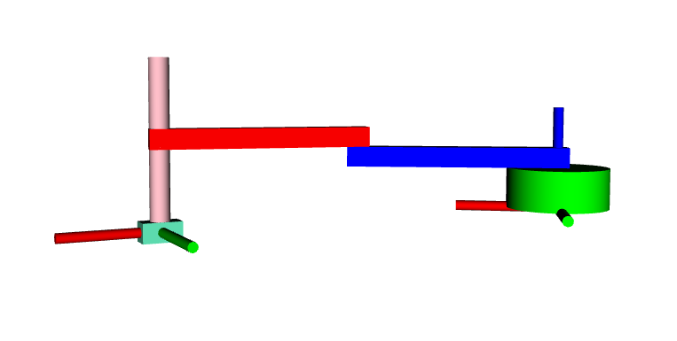
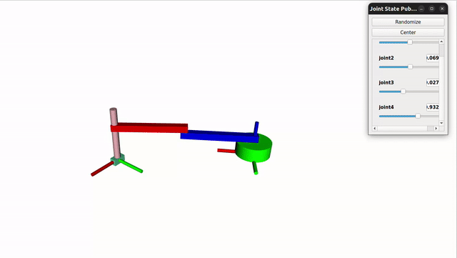

# TP 4 - Modelado de Robots

## Cambios realizados

En el archivo `double_pendulum.urdf` se realizaron los siguientes cambios:

**Links:**

```xml
  <!-- Tercer link: cilindro - brazo -->
  <link name="link3">
      <visual>
          <origin xyz="0 0 0"/>
          <geometry>
              <cylinder radius="0.01" length="0.169"/>
          </geometry>
          <material name="pink">
              <color rgba="1 0.75 0.79 1"/>
          </material>
      </visual>
      <collision>
          <origin xyz="0.1 0 0"/>
          <geometry>
              <box size="0 0 -0.169"/>
          </geometry>
      </collision>
  </link>

  <!-- Tercer link: brazo - rotacion -->
  <link name="link4">
      <visual>
          <origin xyz="0 0 0"/>
          <geometry>
              <box size="0.04 0.02 0.02"/>
          </geometry>
          <material name="lightblue">
              <color rgba="0.4 0.95 0.76 1"/>
          </material>
      </visual>
      <collision>
          <origin xyz="0.1 0 0"/>
          <geometry>
              <box size="0 0 0"/>
          </geometry>
      </collision>
  </link>
```

 **Joints:**

```xml
  <!-- Junta entre link2 y link3 -->
  <joint name="joint3" type="prismatic">
      <parent link="link2"/>
      <child link="link3"/>
      <origin xyz="0.2 0 0"/>
      <axis xyz="0 0 1"/>
      <limit effort="1000" lower="-0.0845" upper="0.065" velocity="1"/>
  </joint>

  <!-- Junta entre link3 y link4 -->
  <joint name="joint4" type="revolute">
      <parent link="link3"/>
      <child link="link4"/>
      <origin xyz="0 0 -0.0845"/>
      <axis xyz="0 0 1"/>
      <limit effort="1000" lower="-3.14" upper="3.14" velocity="5"/>
  </joint>
 ```

 ## Resultado

El resultado se puede observar a continuación:



Y en el siguiente GIF, se puede ver el movimiento del robot implementado



