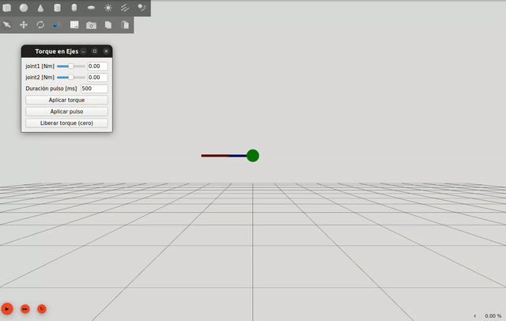

# TP 5 - Dinámica y Simulación

## Cambios realizados

En el archivo `dp.xacro` se realizaron los siguientes cambios:

- Se eliminaron las colisiones de `base_link, link1 y link2`

- El _joint type_ paso de `revolute` a `continuous`

Mientras que en el archivo `dp_params.xacro` los cambios fueron:

- Todos los rozamientos se configuraron en cero:

```xml
  <xacro:arg name="damping1" default="0.0" />                 <!-- rozamiento viscoso -->
  <xacro:arg name="friction1" default="0.00" />               <!-- rozamiento de Coulomb -->
  <xacro:arg name="damping2" default="0.0" />                 <!-- rozamiento viscoso -->
  <xacro:arg name="friction2" default="0.00" />               <!-- rozamiento de Coulomb -->
```

- Se cambió la velocidad del eje 2


 ## Resultado

El resultado de la simulación se puede observar en el siguiente GIF



